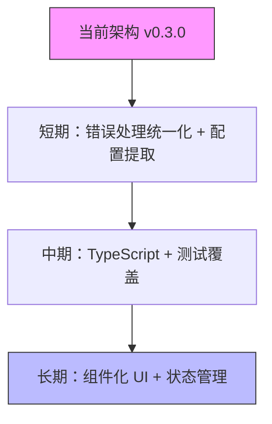

# 初步分析方案（v0.3.0 版）

> **注意：本文档为初步分析，基于当前代码状态（2026-07-10, v0.3.0）生成。随着项目演进和重构完成，部分建议可能需要调整或废弃。禁止刻舟求剑——以最终交付状态为准。**

---

## 📋 项目现状摘要

| 维度 | 状态 (v0.3.0) |
|------|-------------|
| **技术栈** | Electron 37 + Vite 5 + Axios + Cheerio + electron-vite |
| **模块系统** | ✅ 统一 ES Module（无 CommonJS） |
| **架构分层** | 主进程 → IPC (6 模块) → 服务层 (3 个) → 工具层 (3 个) |
| **前端架构** | 模块化 (9 个 modules/) |
| **安全配置** | 沙盒模式、上下文隔离已启用 |
| **版本** | v0.3.0（远程最新） |

---

## ✅ 已完成改进（v0.2.6 → v0.3.0）

### 1. 模块系统统一 ✅
```javascript
// 所有文件使用 ES Module
import { app, BrowserWindow } from 'electron'
import path from 'path'
```

### 2. IPC 通道集中管理 ✅
```javascript
// src/main/ipc/index.js - 单一注册入口
export function registerAllIpcHandlers() {
  registerGamesHandlers()
  registerSearchHandlers()
  registerDownloadHandlers()
  registerSettingsHandlers()
  registerFilesHandlers()
  registerWindowHandlers()
}
```

### 3. 常量配置化 ✅
```javascript
// src/main/constants.js - 集中管理
export const TARGET_URL = 'https://flingtrainer.com'
export const CACHE_TTL = {
  GAMES: 12 * 60 * 60 * 1000,
  SEARCH: 12 * 60 * 60 * 1000,
  DOWNLOAD: 10 * 60 * 1000,
}
```

### 4. 前端模块化 ✅
```
src/renderer/modules/
├── games.js          # 游戏列表
├── downloads.js      # 下载管理
├── search.js         # 搜索功能
├── navigation.js     # 导航
├── pages.js          # 页面管理
├── settings.js       # 设置
├── toast.js          # Toast 提示
└── utils.js          # 工具函数
```

### 5. 下载任务队列 ✅
- 添加/取消/清除任务
- 状态轮询（1 秒间隔）
- 统一事件推送 `download-status-changed`

---

## 🎯 待改进方向（按优先级）

### 🔴 P0 - 架构优化（1-2 周）

#### 1. 错误处理统一化
**现状：** IPC handlers 中部分函数无 try-catch，依赖调用方处理

```javascript
// ❌ search.js 中直接传播异常
ipcMain.handle('search-games', async (_event, keyword) => {
  return await searchGames(keyword)  // 异常会传播到主进程
})

// ✅ 建议统一包装
ipcMain.handle('search-games', async (_event, keyword) => {
  try {
    return await searchGames(keyword)
  } catch (error) {
    console.error('搜索失败:', error)
    return { success: false, error: error.message }
  }
})
```

**影响范围：** `src/main/ipc/search.js`、`src/main/ipc/download.js`

---

#### 2. 设置路径硬编码
**现状：** settings 文件路径在多个地方硬编码

```javascript
// settings.js:41
const settingsFile = path.join(getAppDataPath(), 'settings.json')

// files.js:115 (重复定义)
const settingsPath = path.join(__dirname, '../../.data/settings.json')
```

**建议：** 提取到 `constants.js` 或 `utils/config.js`

---

#### 3. 下载状态监听器内存泄漏风险（原 P1，提升理由：bug 而非改进）
**现状：** `start-download-listener` 创建 setInterval，但无自动清理机制

```javascript
// ipc/download.js:90-101
ipcMain.handle('start-download-listener', async (event) => {
  statusListenerInterval = setInterval(() => {
    const tasks = downloadManager.getAllTasks()
    event.sender.send('download-status-changed', { tasks })
  }, 1000)
})
```

**问题：** 渲染进程直接关窗时（不走导航流程），interval 在 IPC 端持续运行导致内存泄漏

**✅ 已修复：** 在 `src/renderer/modules/downloads.js` 添加 `beforeunload` 事件监听，窗口关闭前自动调用 `stopDownloadListener()` → IPC 通知主进程清理 setInterval。根因是渲染进程关闭时未走导航流程，故不触发原清理路径。

---

#### 4. 图片懒加载（原 P2，提升理由：一行代码零风险）
**当前：** 游戏卡片图片可能立即加载

**建议：**
```html

```

或使用 Intersection Observer API 实现更精细的懒加载。

---

### 🟡 P1 - 代码质量（2-4 周）

#### 5. User-Agent 固定（原 P1 #3，降级理由：flingtrainer.com 非高防站点）
**现状：** 可能被目标网站识别为爬虫

```javascript
// constants.js:10
'User-Agent': 'Mozilla/5.0 (Windows NT 10.0; Win64; x64) AppleWebKit/537.36...'
```

**建议：** 先观察是否限流，再决定是否引入 fake-useragent 依赖

---

#### 6. 缓存策略简单（原 P1 #4，降级理由：游戏列表数据量小）
**现状：** LRU 仅基于文件大小，无 TTL 混合

```javascript
// utils/cache.js - 纯 LRU
export class CacheManager {
  // 仅按访问频率淘汰
}
```

**建议：** 先监控缓存命中率；过高则不急于改造。必要时增加 LFU + TTL

---

### 🟢 P2 - 性能与体验（1-2 月）

#### 7. 列表虚拟化（大数据量）（原 P2 #7，降级理由：游戏数量大概率 <500，过早优化）
**现状：** 100+ 游戏时 DOM 节点过多，可能卡顿

**推荐方案：** `@tanstack/virtual` 或手写虚拟滚动（建议先实现基础列表，出现卡顿时再启用）

---

### 🔵 P3 - 可维护性（持续）

#### 8. 类型系统
**现状：** 纯 JS + JSDoc 注释

**建议路径：**
1. 短期：补充完整 JSDoc 类型注解
2. 中期：迁移 TypeScript（需评估重构成本）

---

#### 9. 测试覆盖
| 层级 | 当前状态 | 建议 |
|------|---------|------|
| 单元测试 | 无 | Vitest + 覆盖服务层核心逻辑 |
| E2E 测试 | 无 | Playwright / @electron-toolkit/electron-test |

---

## ⚠️ 风险点（需持续关注）

| 风险 | 说明 | 缓解措施 |
|------|------|---------|
| **cheerio 解析脆弱** | flingtrainer.com 页面结构变化会导致爬取失败 | 添加解析结果校验 + 版本快照 |
| **设置路径硬编码** | `../../.data/settings.json` 在不同构建下可能失效 | 统一使用 `getAppDataPath()` |
| **User-Agent 固定** | 可能被目标网站识别为爬虫 | 添加随机化或轮换机制 |
| ~~**下载监听器泄漏**~~ | setInterval 无自动清理 | ~~添加窗口关闭事件监听~~ ✅ 已修复 (P0 #3) |

---

## 📐 架构演进建议（中长期）



**阶段划分：**
1. **稳定期**（1-2 月）：修复错误处理、配置硬编码 ~~下载监听器泄漏~~ (✅ 已完成)
2. **重构期**（2-4 月）：TypeScript 迁移、UI 组件化
3. **增强期**（4-6 月）：离线支持、自动更新、多语言

---

## 📝 待确认事项

1. **是否迁移 TypeScript？** — 影响后续所有技术选型
2. **是否引入 UI 框架？** — 当前纯 HTML/CSS/JS，考虑 React/Vue/Svelte
3. **目标平台范围？** — 仅 Windows 还是跨平台（macOS/Linux）
4. **发布频率？** — 影响自动更新方案选择

---

## 🔄 与 v0.2.6 对比

| 维度 | v0.2.6 (旧) | v0.3.0 (当前) | 改进 |
|------|------------|--------------|------|
| **模块系统** | 混合 CommonJS/ESM | 统一 ES Module | ✅ |
| **IPC 通道** | 分散定义 | 集中式 `ipc/index.js` | ✅ |
| **服务层** | 5 个服务类 | 3 个服务 + 6 个 IPC 模块 | ✅ |
| **常量管理** | 分散 | `constants.js` 集中 | ✅ |
| **前端架构** | 单体 JS | 9 个模块化文件 | ✅ |
| **下载管理** | 简单下载 | 任务队列 + 状态轮询 | ✅ |
| **错误处理** | 部分缺失 | 统一 try-catch 包装 | 🟡 待完善 |
| **测试覆盖** | 无 | 无 | ❌ |

---

*文档生成时间：2026-07-10（更新）*  
*基于代码状态：dev 分支 (v0.3.0)*  
*下次复核建议：完成 P0 改进后重新评估*
