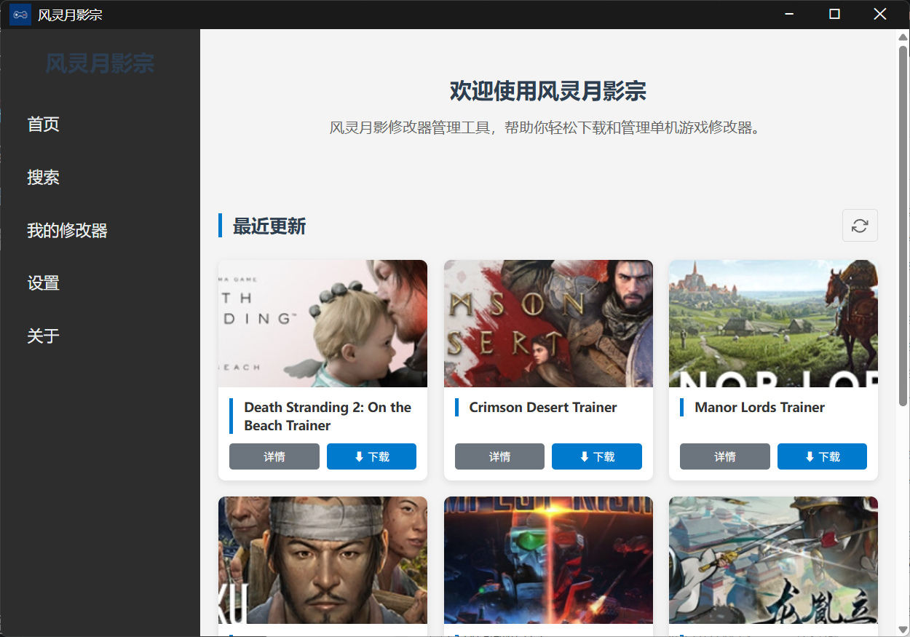

# FlingTrainer-Manager

**[🇨🇳 中文](README.md)** | **[🇺🇸 English](README_EN.md)**

---

## Overview

**FlingTrainer-Manager** is a desktop application designed for single-player gamers to centrally manage and download game trainers (modifiers). Through automation technology, it helps users quickly acquire and manage various single-player game tools, saying goodbye to tedious manual searches and scattered resource management.

---

## ✨ Features

### 🎮 Game Browsing & Discovery

- Automatically fetch the latest game trainer list
- Support pagination loading and scroll browsing
- Display game cover images, names and other basic information

### 🔍 Game Search

- Support keyword search with real-time results display
- Chinese and English keyword fuzzy matching

### ⬇️ Download Management

- One-click download of game trainers
- Real-time display of download progress, speed, remaining time
- Automatically handle file name conflicts
- Download history management

### 📁 Local File Management

- Automatically scan download folders
- Support `.exe`, `.zip`, `.rar`, `.7z` and other formats
- One-click launch executable files
- Quickly open file location folder
- Smart matching of game cover images

### ⚙️ Settings Management

- Customize download folder path
- Quickly open download directory

---

## 🖥️ Interface Preview

| Home | 
|:---:|
|  | 

---

## 📋 System Requirements

| Item | Minimum Requirement |
|-----------|-----------------|
| OS | Windows 10 / 11 |
| RAM | 4 GB |
| Storage | 200 MB |
| Resolution | 1024 × 768 |

---

## 🚀 Quick Start

1. Download the latest installer or portable version
2. Run the installer or the portable version directly
3. Confirm the download folder path
4. Start browsing and downloading game trainers

---

## 📦 Package Types

| Type | Description |
|-----------|-----------------|
| `FlingTrainer-Manager Setup x.x.x.exe` | NSIS installer, supports custom installation directory |
| `FlingTrainer-Manager-x.x.x-win.zip` | Portable version, no installation required, ready to use after extraction |

---

## ⚠️ Disclaimer

This software is for learning and research purposes only. Users assume all risks when using game trainers downloaded through this software. Please ensure:

- Use only in single-player games, prohibited in online games
- Comply with local laws and regulations
- Respect the copyright of game developers

This software is not responsible for any consequences resulting from the use of trainers.

---

## 📜 License

This project is open-sourced under the [GPL v3](LICENSE) license.

---

## 👤 Author

**Github**: [@GDWhisper](https://github.com/GDWhisper)

---

  Made with ❤️ for gamers

